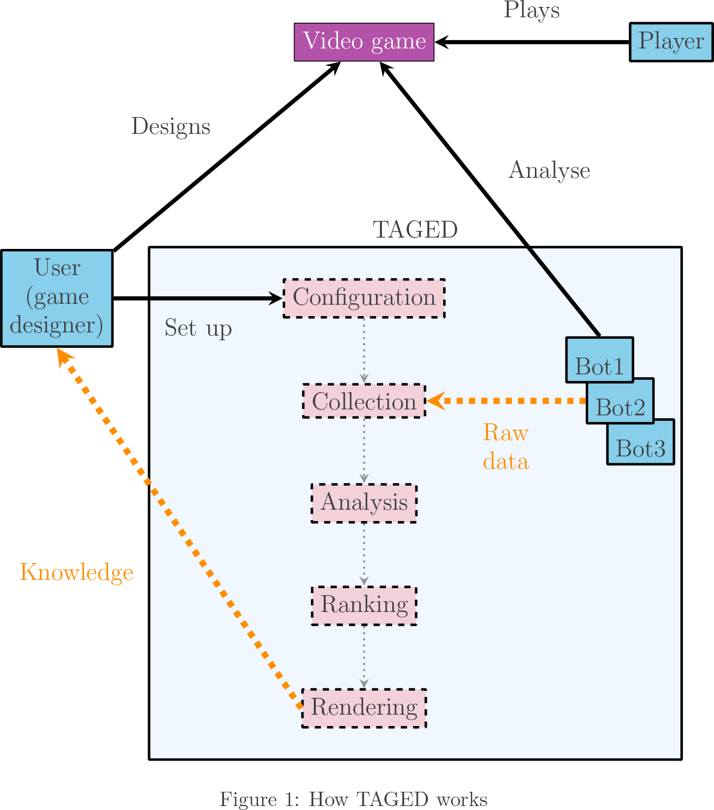
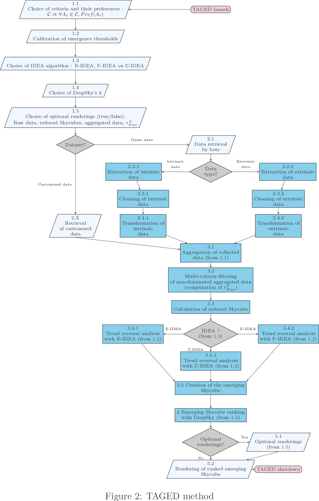

# Summary

Créer un jeu vidéo, et espérer qu'il obtienne autant de succès que possible, devient un défi de taille dans l’environnement compétitif de la première industrie culturelle mondiale. Les jeux vidéo sont bien souvent de plus en plus complexes à concevoir, à développer et à équilibrer.

Les jeux vidéo, notamment ceux en ligne, sont en mesure d'enregistrer la moindre action réalisée par un joueur, collectionnant ainsi des milliards de données sur des milliers et parfois des millions de joueurs. Pour gérer une telle masse d'informations, les outils d'assistance semblent devenir incontournables.

La méthode TAGED, pour *tool assisted game equilibrium design*, que nous proposons offre une solution adaptable à des jeux vidéo solo ou multijoueur possédant un volume important de données chiffrées ou qualitatives exploitables, qu'elles soient intrinsèques au jeu lui-même (des données de personnages, d'objets, de niveaux...) ou liées à son utilisation par les joueurs (des durées de parties ou de boucles de jeu, des scores intermédiaires, des séquences d’actions...).

La recherche d'un bon équilibre dans un jeu vidéo est un concept central car il va fortement impacter la satisfaction des joueurs. Dans le cadre d'un jeu solo, s'il est déséquilibré en terme de difficulté, les joueurs risquent très rapidement de s'en désintéresser par absence de défi, ou inversement, par frustration lié à l'impossibilité d'atteindre son objectif. Dans les jeux multijoueurs, la problématique gagne à la fois en importance et en complexité de part la multiplicité des situations qui explose. Il devient donc crucial de détecter au plus vite ces déséquilibres qui peuvent radicalement déstabiliser un jeu vidéo lorsqu'ils sont découverts par des joueurs qui en tirent un profit perçu comme immérité. L'objectif de notre travail de recherche est donc à la fois de détecter ces déséquilibres par une analyse des données du jeu vidéo et de son moteur de règles mais aussi de les découvrir grâce à une analyse en temps réel de la dynamique des comportements des joueurs.

# Statement of need

TAGED offre un large panel d'usages dans l'équilibrage en conception de jeu vidéo. Son utilisation par les concepteurs de jeux peut se faire durant toute la durée de vie d'un dispositif ludique : qu'il soit en conception, en développement ou en production.

Voici la schématisation du principe de fonctionnement de TAGED :

Et voici la présentation détaillée de TAGED :

TAGED est un outil d'extraction de données qui peut s'utiliser avec des données brutes d'entrée, réelles ou modélisées, intrinsèques au jeu vidéo, comme celles issues des mécaniques, dynamiques ou esthétiques de jeu [@books/lib/SalenZ04], ou bien extrinsèques comme celles extraites des *verbatims* des comportements de joueurs, déviants ou atypiques, et des informations de parties, solo ou multijoueur.

Les connaissances acquises grâce à TAGED permettent d'équilibrer le *gameplay* de jeux vidéo, en influençant notamment l'ajout ou la suppression de briques de *gameplay* [@Alvarez2018] dans le but de garantir au mieux l'état de *flow* [@books/Csikszentmihalyi09].

TAGED s'appuie sur les théories fondamentales suivantes :
- Skyline [@icde/BorzsonyiKS01] et Skycube [@vldb/YuanLLWYZ05]
- Cube de données [@datamine/GrayCBLRVPP97] et cube de données émergent [@dawak/NedjarCCL07]
- Cosky et Top-*k* [@Yiu:2007:Ongoing]

L'approche Skycube alliée à celle de cube de données émergent donne celle de Skycube émergent. Après classement, nous obtenons un Skycube émergent ordonné.

TAGED utilise les algorithmes :
- BNL : block-nested loop is used to compute SKyline
- IDEA : la plateforme algorithmique IDEA, et notamment les algorithmes E-IDEA et F-IDEA, eux-même basés sur l'algorithme BUC [@sigmod/BeyerR99], et comptible avec C-IDEA [@martinnevot:hal-02446921]
- DeepSky : uses multilevel Skylines [@Preisinger:2015:Approach] with Cosky ranking method

# Acknowledgements

We acknowledge the Société d'Accélération du Transfert des Technologies Sud-Est (SATT SE) for its financial support via Franck Orsatti. We also acknowledge contributions from Lotfi Lakhal and Sébastien Nedjar during the genesis of this project.

# References
