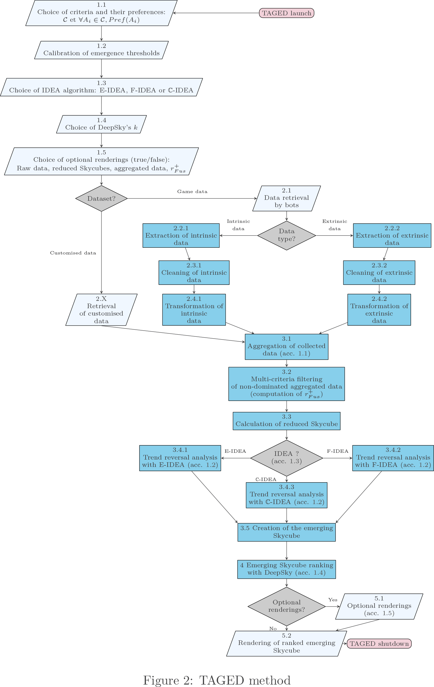

# Summary

Creating video game, and bet on its success and popularity, is becomming a major challenge in the competitive environment of the world's number one cultural industry. Video games often are more and more complex to conceive, develop and balance.

Video games, especially online ones, can record every action of every player, thus generating billions of pieces of data on, sometimes, millions of players. To handle such a volume of information, assistance tools seem to be essential.

The TAGED method (for Tool Assisted Game Equilibrium Design) we propose offers a solution adaptable for single-player or multiplayer games with large volume of numerical or qualitative analysable data, being either intrinsic to the game itself (relative to characters, objects, levels...) or extrinsic, in relation to the players' behaviours (game durations, game loops, intermediate scoring, action sequences...).

Finding proper equilibrium in video game is one central concept as it drastically impact players satisfactions. For single-player games, dificulty disbalance can negatively impact interest of the player due to of the lack of challenge, or on the opposite, generate frustration by the impossibility of goals accomplishment. For multiplayer games, due to significant situations multiplication, the case increase in complexity and importance. Early disbalance detection is crutial as players can exploit it wich may generate frustration among others players. Our researsh main goal is both, to detect those disbalances by video game and rules engine data analysis but aslo to discover them by player dynamics behaviors in real time analysis. 

# Statement of need

TAGED offers wide use case in video game design balancing. Game designers can use TAGED throughout all steps of a game device from conception to production.

TAGED has a TRL 5. It is applied for now on three popular and different video games: Pokemon Showdown! as collectible type, Diablo III: Reaper of Souls as Hack 'n' shash type and Open Match 3 as match-three puzzle-game type. This types diversity serve as our porposition demonstrator, even for such heterogeneous games.

Here is a schematic diagram of how TAGED works:
<!--- 

	

 --->
 

And here is the TAGED method:
<!--- 

	

 --->
 

TAGED is a data extraction tool wich can be used with raw data input, real or modelled, video game intrinsic, such as those derived from game mecanics, dynamics or esthetics [@books/lib/SalenZ04], or extrinsic as those from player behaviour verbatims, deviant or atypical, and single or multiplayer game information.

TAGED knowledge generated simplify video game gameplay equilibrium, especially influencing gameplay tiles addition or removal [@Alvarez2018] in order to best ensure the state of flow [@books/Csikszentmihalyi09].

TAGED is based on the following fundamental theories:

- Skyline [@icde/BorzsonyiKS01] and Skycube [@vldb/YuanLLWYZ05]

- Datacube [@datamine/GrayCBLRVPP97] and emergent datacube [@dawak/NedjarCCL07]

- Cosky and Top-k [@Yiu:2007:Ongoing]

Combined Skycube and emergent datacube approach provide emergent Skycube. After ranking, we obtained ranked emerging Skycube. 

TAGED uses the following algorithms :

- BNL: block-nested loop is used to compute Skyline

- IDEA: IDEA BUC algorithm based plateform [@sigmod/BeyerR99], especially E-IDEA and F-IDEA algorithms, and C-IDEA ready [@martinnevot:hal-02446921]

- DeepSky: uses multilevel Skylines [@Preisinger:2015:Approach] with Cosky ranking method

# Acknowledgements

We acknowledge the Société d'Accélération du Transfert des Technologies Sud-Est (SATT SE) for its financial support via Franck Orsatti. We also acknowledge contributions from Lotfi Lakhal and Sébastien Nedjar during the genesis of this project.

# References
